# 概念
- kubernetes是**云原生操作系统**，是构建现代应用的基石。

- 现代应用是什么？是微服务，是服务网格，这些统统要围绕着容器来开发、部署和运行，而使用容器就必然要用到容器编排技术，在现在只有唯一的选项，那就是 Kubernetes。


# 1、容器—— docker
`docker pull busybox      #拉取busybox镜像` 类似于ubuntu中apt install软件
`docker images` 展示所有镜像

## （1）docker engine
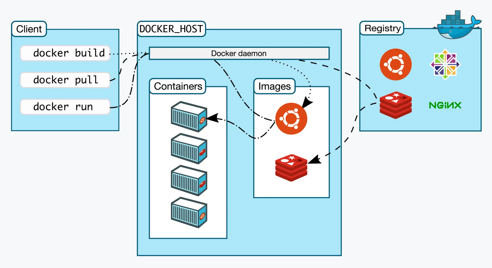
刚才我们敲的命令行 docker 实际上是一个客户端 client ，它会与 Docker Engine 里的后台服务 Docker daemon 通信，而镜像则存储在远端的仓库 Registry 里，客户端并不能直接访问镜像仓库。

`docker run hello-world` :
它会先检查本地镜像，如果没有就从远程仓库拉取，再运行容器，最后输出运行信息：

- Docker Engine 需要使用命令行操作，主命令是 docker，后面再接各种子命令。
- 查看 Docker 的基本信息的命令是 docker version 和 docker info ，其他常用的命令有 docker ps、docker pull、docker images、docker run。
- Docker Engine 是典型的客户端 / 服务器（C/S）架构，命令行工具 Docker 直接面对用户，后面的 Docker daemon 和 Registry 协作完成各种功能。

## （2）容器的本质
- 容器技术是动态的容器、静态的镜像和远端的仓库这三者的组合
- 容器，就是一个特殊的隔离环境，它能够让进程只看到这个环境里的有限信息，不能对外界环境施加影响

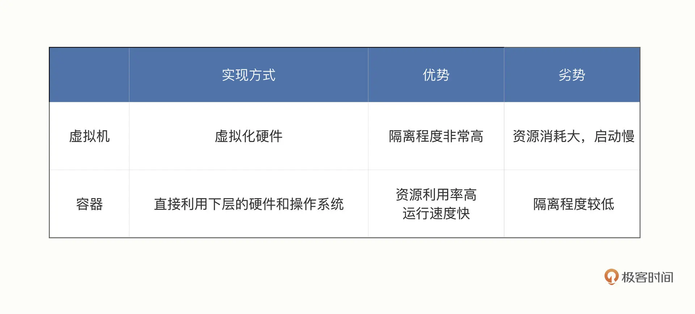

### 隔离的实现 ：
奥秘就在于 Linux 操作系统内核之中，为资源隔离提供了三种技术：namespace、cgroup、chroot，虽然这三种技术的初衷并不是为了实现容器，但它们三个结合在一起就会发生奇妙的“化学反应”。
- namespace 是 2002 年从 Linux 2.4.19 开始出现的，和编程语言里的 namespace 有点类似，它可以创建出独立的文件系统、主机名、进程号、网络等资源空间，相当于给进程盖了一间小板房，这样就实现了系统全局资源和进程局部资源的隔离。
- cgroup 是 2008 年从 Linux 2.6.24 开始出现的，它的全称是 Linux Control Group，用来实现对进程的 CPU、内存等资源的优先级和配额限制，相当于给进程的小板房加了一个天花板。
- chroot 的历史则要比前面的 namespace、cgroup 要古老得多，早在 1979 年的 UNIX V7 就已经出现了，它可以更改进程的根目录，也就是限制访问文件系统，相当于给进程的小板房铺上了地砖。

## 容器化的应用
容器就是被隔离的进程。
**镜像**和常见的 tar、rpm、deb 等安装包一样，都打包了应用程序，但最大的不同点在于它里面不仅有基本的可执行文件，还有应用运行时的整个系统环境。这就让镜像具有了非常好的跨平台便携性和兼容性，能够让开发者在一个系统上开发（例如 Ubuntu），然后打包成镜像，再去另一个系统上运行（例如 CentOS），完全不需要考虑环境依赖的问题，是一种更高级的应用打包方式。

所谓的“容器化的应用”，或者“应用的容器化”，就是指应用程序**不再直接和操作系统**打交道，而是封装成镜像，再交给容器环境去运行。
镜像就是静态的应用容器，容器就是动态的应用镜像，两者互相依存，互相转化，密不可分。

docker images:
IMAGE ID:镜像的身份证
`docker rmi image id`：删除镜像
`docker run -h srv alpine hostname`:这里的 -h srv 就是容器的运行参数，alpine 是镜像名，它后面的 hostname 表示要在容器里运行的“hostname”这个程序，输出主机名。

```
-it 表示开启一个交互式操作的 Shell，这样可以直接进入容器内部，就好像是登录虚拟机一样。（它实际上是“-i”和“-t”两个参数的组合形式）
-d 表示让容器在后台运行，这在我们启动 Nginx、Redis 等服务器程序的时候非常有用。
--name 可以为容器起一个名字，方便我们查看，不过它不是必须的，如果不用这个参数，Docker 会分配一个随机的名字。
```

docker run是针对容器本身启动，而docker exec是进入了容器内部去跑命令，相当于进去操作系统跑应用。

## 实践
我们需要用 -p 参数把本机的端口映射到 Nginx 容器内部的 80 端口，再用 -v 参数把配置文件挂载到 Nginx 的“conf.d”目录下。这样，Nginx 就会使用刚才编写好的配置文件，在 80 端口上监听 HTTP 请求，再转发到 WordPress 应用：
```
docker run -d --rm \
    -p 80:80 \
    -v `pwd`/wp.conf:/etc/nginx/conf.d/default.conf \
    nginx:alpine
```
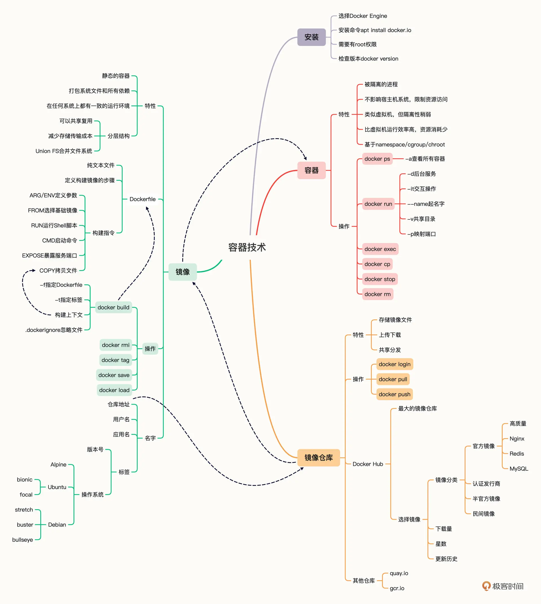
# kubernetes
## 容器编排
这些容器之上的管理、调度工作，就是这些年最流行的词汇：“容器编排”（Container Orchestration）。

## kubernetes
Kubernetes 就是一个生产级别的容器编排平台和集群管理系统
**云原生**：所谓的“云”，现在就指的是 Kubernetes，那么“云原生”的意思就是应用的开发、部署、运维等一系列工作都要向 Kubernetes 看齐，使用容器、微服务、声明式 API 等技术，保证应用的整个生命周期都能够在 Kubernetes 环境里顺利实施，不需要附加额外的条件。

## 自动化运维管理
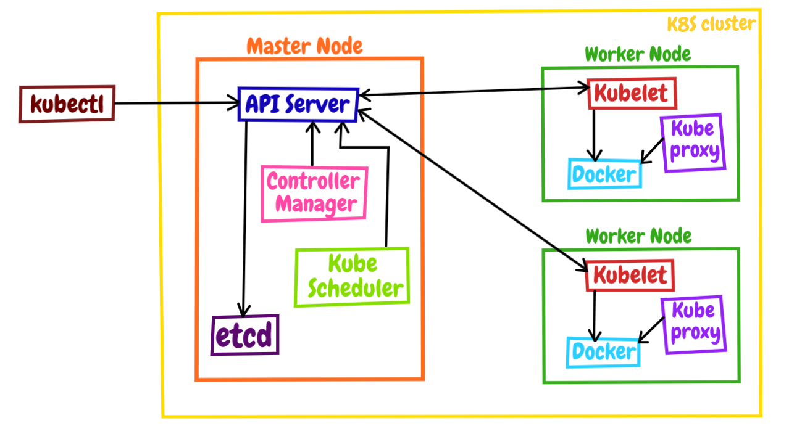

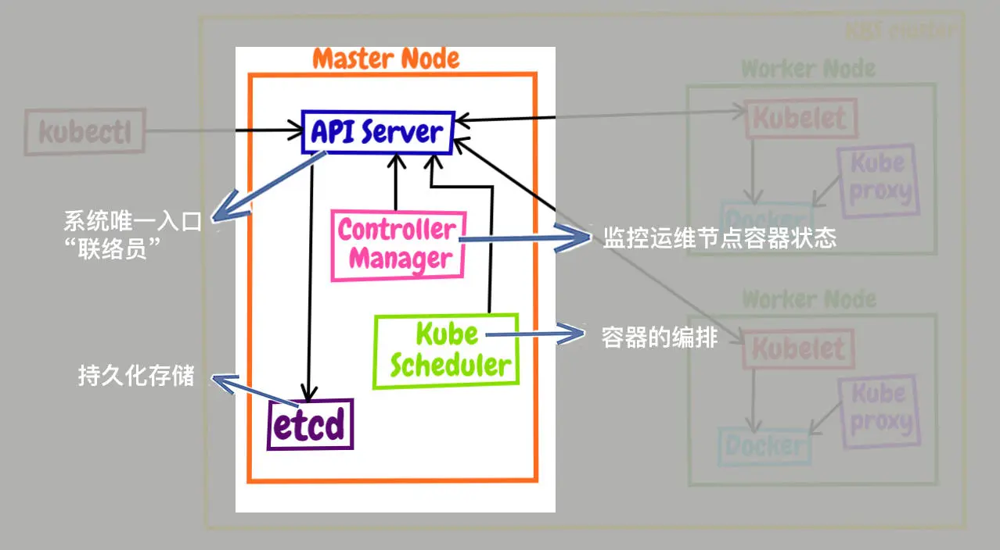
- 集群存储
在控制平面中，只有集群存储是有状态的（会持久化的意思），存储集群的配置与状态。Kubernetes 底层用 etcd。etcd 认为一致性比可用性更加重要。对于所有分布式数据库，写操作性的一致性至关重要。etcd 使用 Raft 一致性算法解决这个问题。

- Controller 管理器
Controller 管理器实现了控制循环，完成集群监控与事件响应。它负责创建 controller。一般控制循环包括：工作节点 controller、终端 controller 以及副本 controller。集群监控目的是保证集群当前状态与期望状态相匹配。集群监控基础逻辑大致如下：
    * 获取期望状态。
    * 观察当前状态。
    * 判断差异。    
    * 变更消除差异点。

- 调度器
调度器职责是监听 API Server 来启动工作任务，并分配合适的节点。它的核心是排序系统，该系统有评分机制，将工作分配到分数最高的节点来运行任务。调度器确定可以执行任务的节点后，还会再进行前置校验，例如该节点是否仍然存在、分配的任务需要的端口当前选择的工作节点是否可以访问等，如果无法通过，该节点会被直接忽略，如果调度器最后无法找到合适的工作节点，则当前任务无法被调度，并被标记为暂停状态。
需要特别注意，调度器不负责运行任务，只为任务负责分配合适的工作节点。

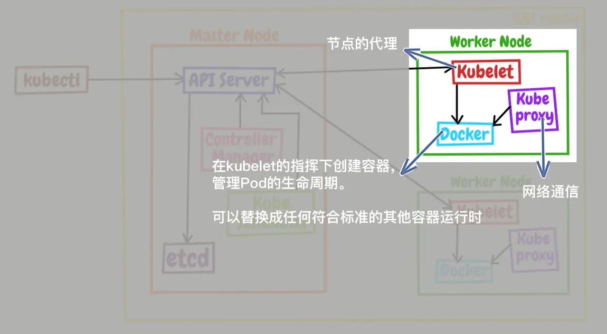
- Kubelet
工作节点的核心部分。新工作节点加入节点后，Kubelet 会被部署到新节点，然后 Kubelet 将当前节点注册到集群中。它还有一个职责，监听 API Server 分配的任务，监听到就执行该任务，并维护一个与控制平面的通信频道。
- 容器运行时
工作节点需要通过它来获取、启动、停止执行任务依赖的容器，它负责容器管理与运行逻辑。

Kubernetes 的大致工作流程了：每个 Node 上的 kubelet 会定期向 apiserver 上报节点状态，apiserver 再存到 etcd 里。每个 Node 上的 kube-proxy 实现了 TCP/UDP 反向代理，让容器对外提供稳定的服务。scheduler 通过 apiserver 得到当前的节点状态，调度 Pod，然后 apiserver 下发命令给某个 Node 的 kubelet，kubelet 调用 container-runtime 启动容器。controller-manager 也通过 apiserver 得到实时的节点状态，监控可能的异常情况，再使用相应的手段去调节恢复。

**架构**：
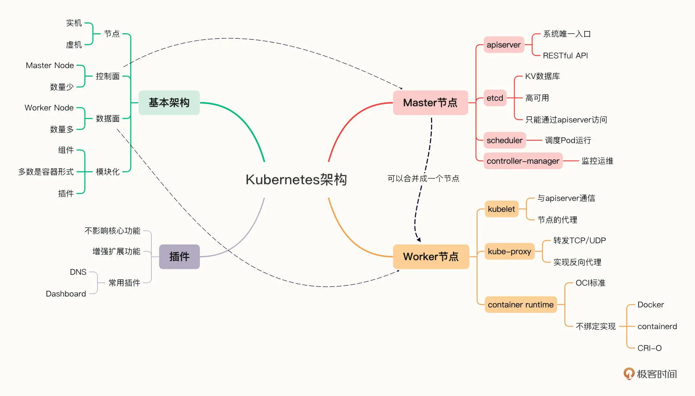

## YAML
- 使用空白与缩进表示层次（有点类似 Python），可以不使用花括号和方括号。
- 可以使用 # 书写注释，比起 JSON 是很大的改进。
- 对象（字典）的格式与 JSON 基本相同，但 Key 不需要使用双引号。
- 数组（列表）是使用 - 开头的清单形式（有点类似 MarkDown）。
- 表示对象的 : 和表示数组的 - 后面都必须要有空格。
- 可以使用 --- 在一个文件里分隔多个 YAML 对象。

K8s 所有东西都叫资源对象：Pod、Deployment、Service、ConfigMap、Ingress、Namespace 等，每一份 YAML 对应一个 API 对象。
**YAML 的作用**：向 K8s API Server 声明「我想要集群里存在一个什么样的资源」。K8s 是声明式 API：只写最终期望状态，不用写操作步骤，控制器自动调谐到目标状态。

```
# YAML对象(字典)
Kubernetes:
  master: 1
  worker: 3
```
- YAML 是 JSON 的超集，支持数组和对象，能够描述复杂的状态，可读性也很好。
- Kubernetes 把集群里的一切资源都定义为 API 对象，通过 RESTful 接口来管理。描述 API 对象需要使用 YAML 语言，必须的字段是 apiVersion、kind、metadata。
- 命令 kubectl api-resources 可以查看对象的 apiVersion 和 kind，命令 kubectl explain 可以查看对象字段的说明文档。
-命令 kubectl apply、kubectl delete 发送 HTTP 请求，管理 API 对象。
- 使用参数 --dry-run=client -o yaml 可以生成对象的 YAML 模板，简化编写工作。

### 格式
每份合法 K8s YAML 都有 4 个顶层字段，用来标识 API 对象信息：
- apiVersion
资源所属 API 版本，区分资源分组，如 apps/v1、v1、networking.k8s.io/v1
- kind
资源类型（API 对象类型）：Pod / Deployment / Service / ConfigMap
- metadata
元数据：名称、命名空间、标签、注释，用来标识、筛选资源
- spec(交代运行时规格)
期望状态（核心）：告诉 K8s 这个对象该具备什么能力、配置、规则
Deployment spec：副本数、升级策略、Pod 模板
Service spec：端口、负载均衡、后端 Pod 标签选择器
Pod spec：容器列表、镜像、资源限制、挂载卷

## pod
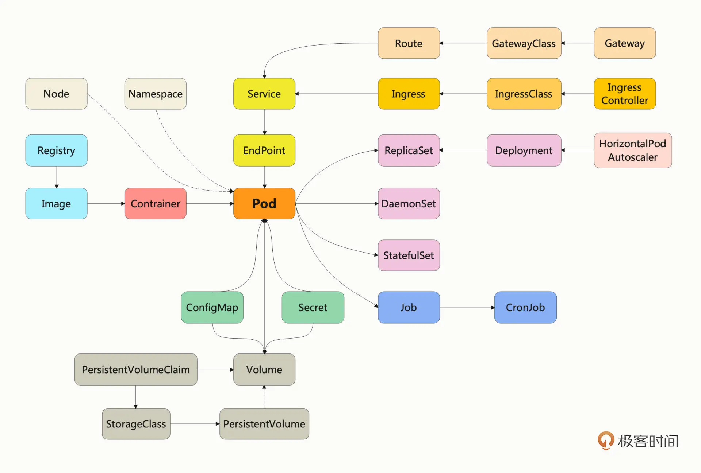
> 让 Pod 去编排处理容器，然后把 Pod 作为应用调度部署的最小单位，Pod 也因此成为了 Kubernetes 世界里的“原子

```
spec:
  containers:
  - image: busybox:latest
    name: busy
    imagePullPolicy: IfNotPresent
    env:
      - name: os
        value: "ubuntu"
      - name: debug
        value: "on"
    command:
      - /bin/echo
    args:
      - "$(os), $(debug)"
```
我为 Pod 指定使用镜像 busybox:latest，拉取策略是 IfNotPresent ，然后定义了 os 和 debug 两个环境变量，启动命令是 /bin/echo，参数里输出刚才定义的环境变量。

- ports：列出容器对外暴露的端口，和 Docker 的 -p 参数有点像。
- imagePullPolicy：指定镜像的拉取策略，可以是 Always/Never/IfNotPresent，一般默认是 IfNotPresent，也就是说只有本地不存在才会远程拉取镜像，可以减少网络消耗。
- env：定义 Pod 的环境变量，和 Dockerfile 里的 ENV 指令有点类似，但它是运行时指定的，更加灵活可配置
- command：定义容器启动时要执行的命令，相当于 Dockerfile 里的 ENTRYPOINT 指令。
- args：它是 command 运行时的参数，相当于 Dockerfile 里的 CMD 指令，这两个命令和 Docker 的含义不同，要特别注意。

## pod不直接处理业务
**面向对象**： **单一职责**、**组合优于继承**（应该尽量让对象在运行时产生联系，保持松耦合，而不要用硬编码的方式固定对象的关系）
所以pod就专门用来管理容器，而其他功能交给其他对象

**两大类业务** ：
- 在线业务
- 离线业务：
    - 临时任务：API对象Job
    - 定时任务:API对象CronJob

### YAML描述job
**头文件**：
- apiVersion 不是 v1，而是 batch/v1。
-kind 是 Job，这个和对象的名字是一致的。
-metadata 里仍然要有 name 标记名字，也可以用 labels 添加任意的标签。
*要创建 Pod 以外的其他 API 对象，需要使用命令 kubectl create，再加上对象的类型名。*

```
apiVersion: batch/v1
kind: Job
metadata:
  name: echo-job

spec:
  template:
    spec:
      restartPolicy: OnFailure
      containers:
      - image: busybox
        name: echo-job
        imagePullPolicy: IfNotPresent
        command: ["/bin/echo"]
        args: ["hello", "world"]
```
其实就是在 Job 对象里应用了组合模式，template 字段定义了一个“应用模板”，里面嵌入了一个 Pod，这样 Job 就可以从这个模板来创建出 Pod。而这个 Pod 因为受 Job 的管理控制，不直接和 apiserver 打交道，也就没必要重复 apiVersion 等“头字段”，只需要定义好关键的 spec，描述清楚容器相关的信息就可以了，可以说是一个“无头”的 Pod 对象。
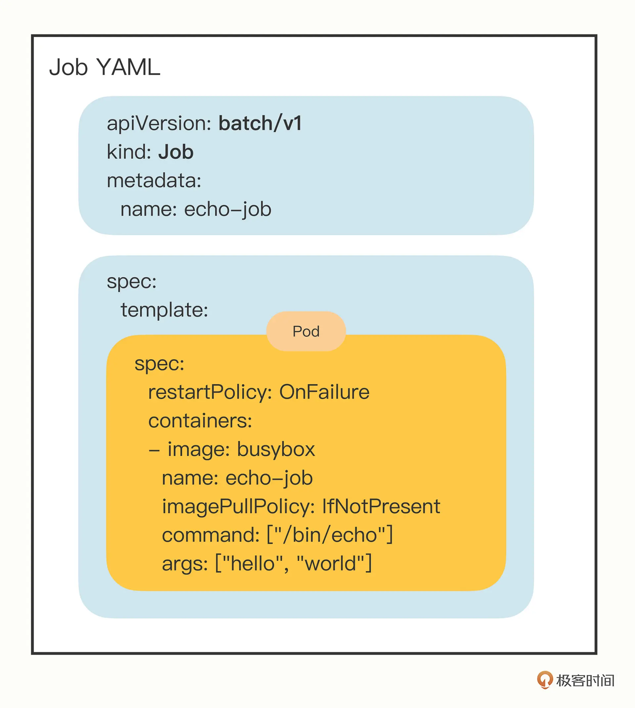

**控制离线作业**：
- activeDeadlineSeconds，设置 Pod 运行的超时时间。
- backoffLimit，设置 Pod 的失败重试次数。
- completions，Job 完成需要运行多少个 Pod，默认是 1 个。
- parallelism，它与 completions 相关，表示允许并发运行的 Pod 数量，避免过多占用资源。

### YAML描述CronJob
**创建**：
第一，因为 CronJob 的名字有点长，所以 Kubernetes 提供了简写 cj，这个简写也可以使用命令 kubectl api-resources 看到；第二，CronJob 需要定时运行，所以我们在命令行里还需要指定参数 --schedule。
```
export out="--dry-run=client -o yaml"              # 定义Shell变量
kubectl create cj echo-cj --image=busybox --schedule="" $out
```
```
apiVersion: batch/v1
kind: CronJob
metadata:
  name: echo-cj

spec:
  schedule: '*/1 * * * *'
  jobTemplate:
    spec:
      template:
        spec:
          restartPolicy: OnFailure
          containers:
          - image: busybox
            name: echo-cj
            imagePullPolicy: IfNotPresent
            command: ["/bin/echo"]
            args: ["hello", "world"]
```
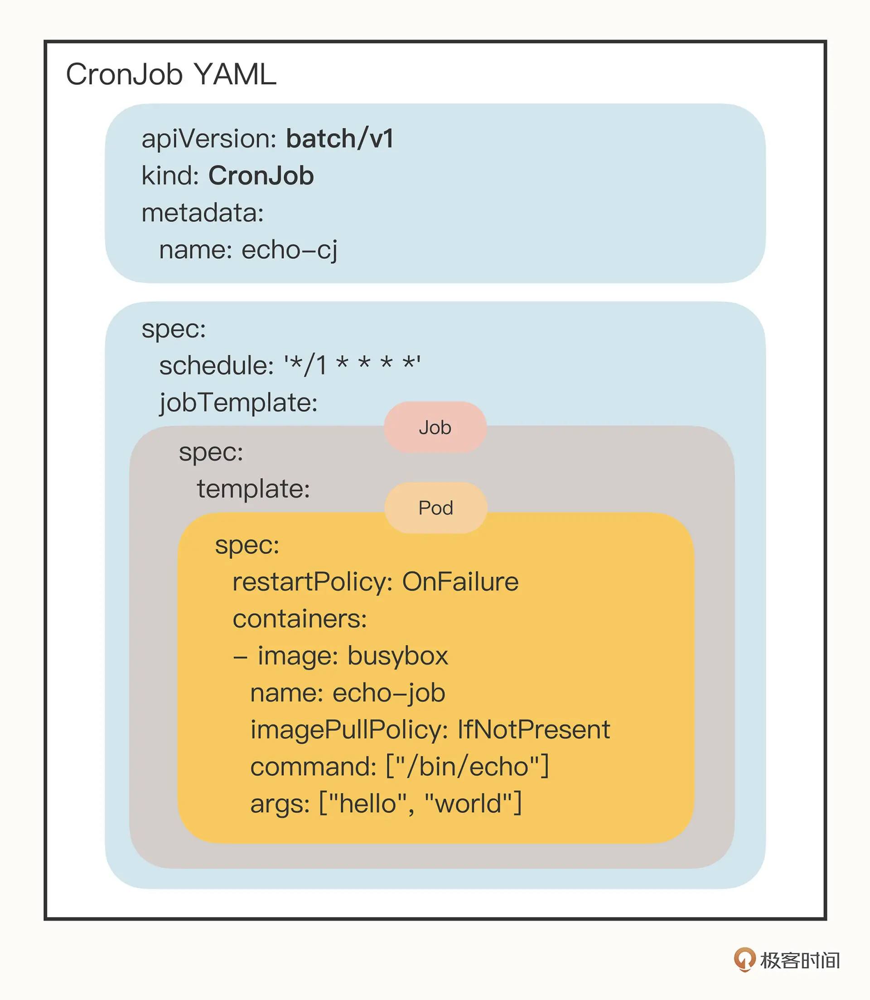
### 总结
CronJob 使用定时规则控制 Job，Job 使用并发数量控制 Pod，Pod 再定义参数控制容器，容器再隔离控制进程，进程最终实现业务功能，层层递进的形式有点像设计模式里的 Decorator（装饰模式），链条里的每个环节都各司其职，在 Kubernetes 的统一指挥下完成任务。

## 管理配置文件
- 第一种是编写 Dockerfile，用 COPY 指令把配置文件打包到镜像里；
- 第二种是在运行时使用 docker cp 或者 docker run -v，把本机的文件拷贝进容器。

管理配置信息的两种对象：
- **ConfigMap：保存明文配置**
- **Secret**:保存秘密配置(要求数据必须是 Base64 编码)

### ConfigMap
```
export out="--dry-run=client -o yaml"        # 定义Shell变量
kubectl create cm info $out
```
得到yaml:
```
apiVersion: v1
kind: ConfigMap
metadata:
  name: info
```
创建configMap对象：
`kubectl apply -f cm.yml`

### Secret
- 访问私有镜像仓库的认证信息
- 身份识别的凭证信息
- HTTPS 通信的证书和私钥
- 一般的机密信息（格式由用户自行解释）

```
apiVersion: v1
kind: Secret
metadata:
  name: user

data:
  name: cm9vdA==
```
### 使用
因为 ConfigMap 和 Secret 只是一些**存储在 etcd 里的字符串**，所以如果想要在运行时产生效果，就必须要以某种方式“注入”到 Pod 里，让应用去读取。在这方面的处理上 Kubernetes 和 Docker 是一样的，也是两种途径：**环境变量和加载文件**。

#### 环境变量
“valueFrom”字段指定了环境变量值的来源，可以是“configMapKeyRef”或者“secretKeyRef”，然后你要再进一步指定应用的 ConfigMap/Secret 的“name”和它里面的“key”，要当心的是这个“name”字段是 API 对象的名字，而不是 Key-Value 的名字。
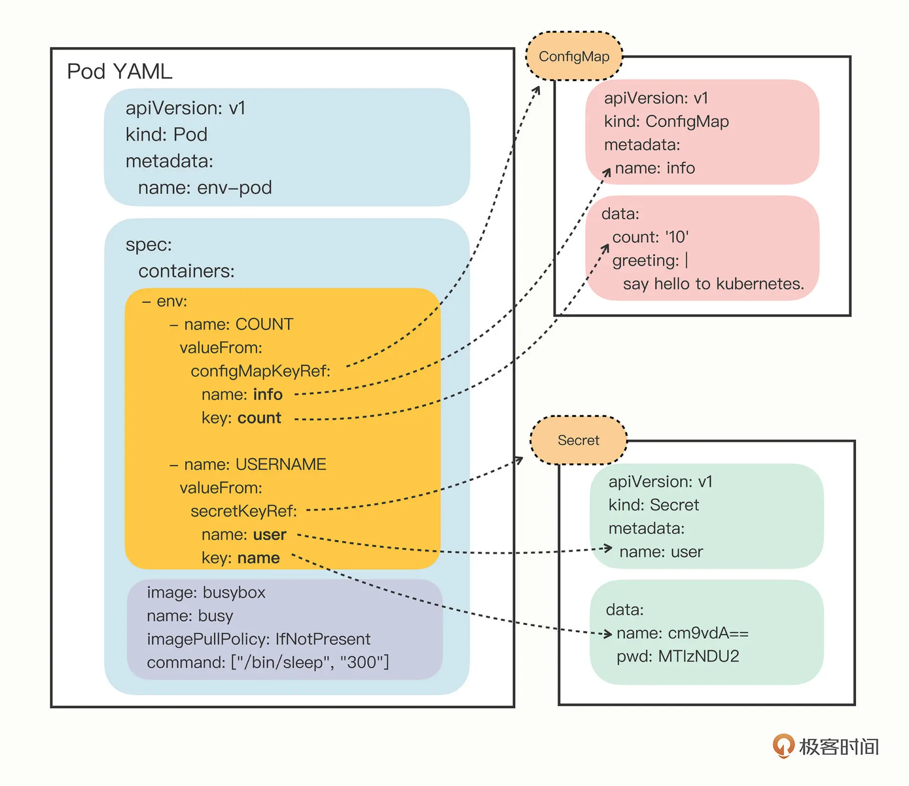

#### 加载文件
定义两个 Volume，分别引用 ConfigMap 和 Secret，名字是 cm-vol 和 sec-vol：
```
spec:
  volumes:
  - name: cm-vol
    configMap:
      name: info
  - name: sec-vol
    secret:
      secretName: user
```
挂载：
```
  containers:
  - volumeMounts:
    - mountPath: /tmp/cm-items
      name: cm-vol
    - mountPath: /tmp/sec-items
      name: sec-vol
```
以 Volume 的概念统一抽象了所有的存储，不仅现在支持 ConfigMap/Secret，以后还能够支持临时卷、持久卷、动态卷、快照卷等许多形式的存储，扩展性非常好。

更新配置文件后通过env加载的 kubectl apply后对应pod里的配置变量都不会更新
但通过文件加载的会更新（有延时