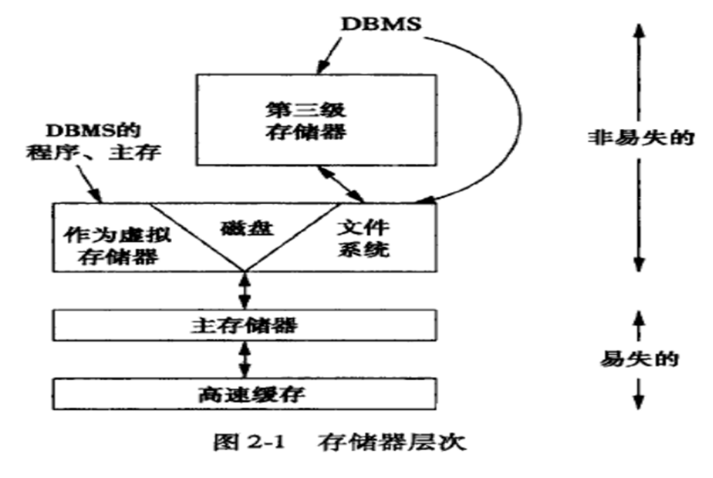

## 2、存储管理器
### 存储器层次

- 高速缓冲存储器
    1、高速缓存（cache）分成一级、二级和三级缓存，一般一
    级缓存和处理器同一个芯片，二级缓存位于另外一个芯片。
    2、高速缓存和处理器间的数据读写以处理器指令的速度执
    行，通常为几纳秒左右（1ns=10-9s) 。

- 主存储器
    1、主存随机访问，即同一时间内可获得任何一个字节
    2、主存上的一次数据访问时间通常是10纳秒（1ns=10-9s）。

- 虚拟存储器（二级存储器的一部分
    1、由于虚拟存储器的地址空间比内存大，虚拟存储器的大
部分内容是保存在硬盘上。
    2、硬盘逻辑块（block）的大小一般是4~64KB。
    3、虚拟存储器以块为单位在硬盘和主存间移动，在主存中
块常称为页（page）

- 二级存储器
    1、从磁盘上读一个块到内存，是一次磁盘读
    2、内存中的一页写到磁盘，是一次磁盘写。
    3、一次磁盘读或者一次磁盘写都称为一次磁盘I/O

**二级存储器的访问速度比内存访问速度慢105～106 倍。**
硬盘不仅支持文件系统，也支持虚拟存储器，即有些磁盘块被用于保存一个应用程序的虚拟内存页面，有些磁盘块用于保存文件（**磁盘=文件系统+虚拟存储）**

### 计算模型
- RAM计算模型
    假定数据放在主存储器中，对任何单位数据访问所花费的时间一样多
- I/O计算模型
    数据装在二/三级存储器中，降低磁盘访问次数

### 基本sql数据类型
- char
- varchar
- int integer
- float
- bit
- date time

### 记录的构造
数据库中每一种类型的记录必须有一个模式（所有模式存放在一个文件或者和**每个表的模式和实例**存放在一个文件），**模式也由数据库存储**，包括
- 每个字段名称
- 每个字段数据类型
- 每个字段在记录内的偏移量