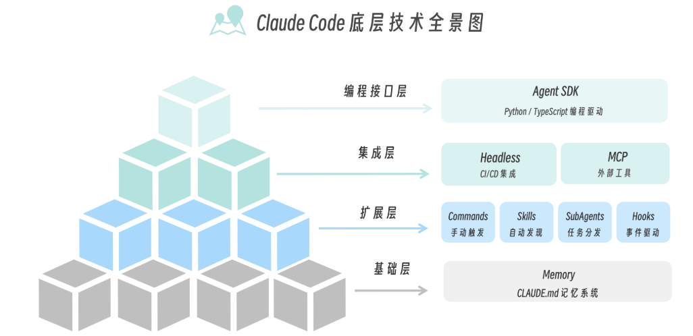

# 工程化实践
Skills（技能）  的核心思想是：AI 应该知道什么时候用什么能力。——按需加载的能力与语义触发
# 底层技术
`claude -c` 继续最近的对话


### 基础层——记忆系统：
Claude Code 的长期记忆系统，它的核心文件是 CLAUDE.md
Claude 每次开始对话时，都会读取这个文件。这样它就“记住”了你的项目规范，不需要每次重复说明。
Claude Code 并不是只有一个CLAUDE.md记忆文件，全局、项目和项目的特定模块都可以拥有属于自己的记忆文件（或者也可以叫配置文件）。
```
~/.claude/CLAUDE.md           # 全局（所有项目共用）
    ↓
项目根目录/CLAUDE.md          # 项目级（当前项目）
    ↓
项目根目录/.claude/rules/*.md # 模块级（特定目录）
```

### 扩展层——核心组件
是**能力中心**，包含 Commands（斜杠命令）、Skills（技能）、SubAgents（子代理）、Hooks（钩子）四个核心组件。
- commands
用户输入: /review
Claude 执行: 根据 .claude/commands/review.md 的指令审查代码

- hooks
特定事件触发时自动执行的脚本，其触发方式是事件自动触发。

### 集成层
>负责链接外部世界。集成层包含 Headless（无头模式）和 MCP（Model Context Protocol）两大技术。

- headless
在没有人工交互的情况下运行，适合**CI/CD 集成**——自动代码审查、自动修复、自动生成变更日志等。
```
# GitHub Actions 中
- name: Auto-fix code issues
  run: claude --headless "Fix all linting errors in src/"
```

- MCP
让 Claude 连接外部工具和服务，适合工具连接——可以把任何外部系统变成 Claude 可调用的工具。

### 编程接口 agent sdk
适合构建自定义 Agent——完全控制执行流程、自定义工具、复杂工作流。

**plugins 打包容器**：
开发了一套好用的 Commands、Skills、Hooks 组合，想要分享给团队或社区时，就需要 Plugins。
Plugins 不是一种新能力，而是打包机制——就像 npm 包把一堆 JavaScript 文件打包在一起，Plugin 把一组相关的 Claude Code 扩展打包在一起。